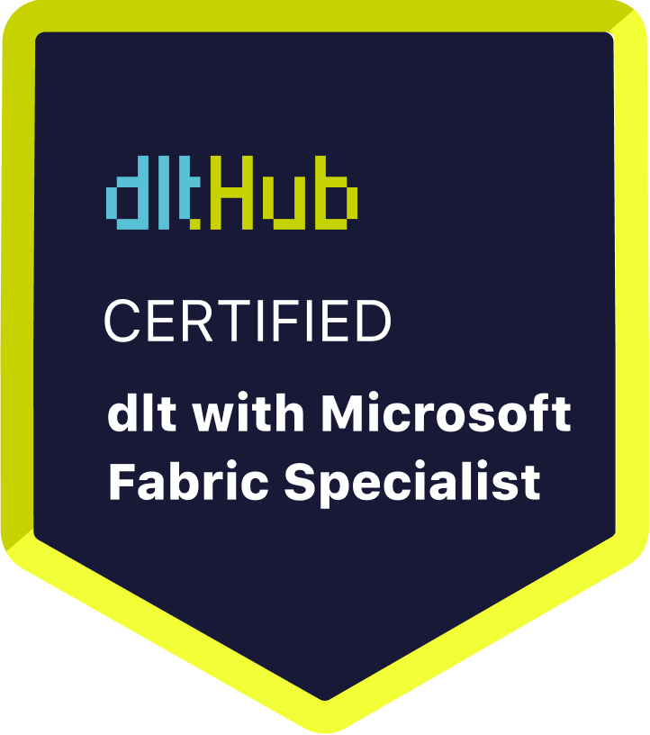

# Certificate of Achievement: dlt Microsoft Fabric Specialist

## Awarded to **Meet Shah**

### Certificate Details
- **Certificate ID**: `0bd50508eca6950f9127c5e59592d726f0a3ea83400cd2ce737bc8b1dfc86cf5`
- **Certificate Holder ID**: `ebd90f1ba4fba7c0db77885320b0eb2cdae60a04965704e40a32e69267302242`

### Course Information
- **Course**: [Build secure code-first data pipelines in Microsoft Fabric](https://www.youtube.com/live/wca8DnKucBM)

### Issued by
[**dltHub**](https://dlthub.com/) 

### Certification Period
- **Issued**: June 2025
- **Valid Until**: No expiration

---

## Contact Information
- **GitHub**: 
- **Contact**: 

## Comments
Meet Shah has successfully completed the Build secure code-first data pipelines in Microsoft Fabric. We commend their dedication and expertise in the field.

---

For more information, please visit [dltHub](https://dlthub.com/).
    