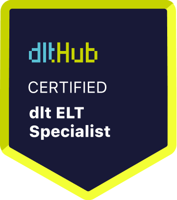

# Certificate of Achievement: dlt ELT Specialist

## Awarded to **Hasan Geren**

### Certificate Details
- **Certificate ID**: `538fdc437a1fe1d2a9076ee80ad3e1ba70e55fd8537e93bdd00e802584947e14`
- **Certificate Holder ID**: `6a2faebd2504f1b56dd8fb02b3ed8d434430eb334b22db925d946887a3fc2969`

### Course Information
- **Course**: [Course ELT with dlt: dlt Fundamentals](https://github.com/dlt-hub/dlthub-education/tree/main/courses/dlt_fundamentals_dec_2024)

### Issued by
[**dltHub**](https://dlthub.com/) 

### Certification Period
- **Issued**: December 2024
- **Valid Until**: No expiration

---

## Contact Information
- **GitHub**: 
- **Contact**: https://www.linkedin.com/in/hasan-geren/

## Comments
Hasan Geren has successfully completed the Course ELT with dlt: dlt Fundamentals. We commend their dedication and expertise in the field.

---

For more information, please visit [dltHub](https://dlthub.com/).
    