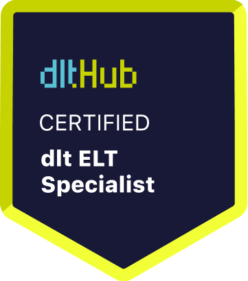

# Certificate of Achievement: dlt ELT Specialist

## Awarded to **Damian Pacholec**

### Certificate Details
- **Certificate ID**: `56b4c179d9bc08c626323bed703dcda603442a81fad43d583b5f65c364ee032d`
- **Certificate Holder ID**: `e86d044dd63c85bada1327659078c402359aacfa320e0174e29808994d7634fd`

### Course Information
- **Course**: [Course ELT with dlt: dlt Fundamentals](https://github.com/dlt-hub/dlthub-education/tree/main/courses/dlt_fundamentals_dec_2024)

### Issued by
[**dltHub**](https://dlthub.com/) 

### Certification Period
- **Issued**: July 2025
- **Valid Until**: No expiration

---

## Contact Information
- **GitHub**: 
- **Contact**: 

## Comments
Damian Pacholec has successfully completed the Course ELT with dlt: dlt Fundamentals. We commend their dedication and expertise in the field.

---

For more information, please visit [dltHub](https://dlthub.com/).
    