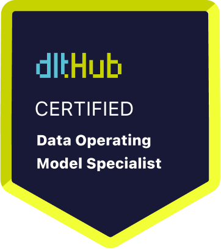

# Certificate of Achievement: Data Operating Model Specialist

## Awarded to **Jonathan Schwarzhaupt**

### Certificate Details
- **Certificate ID**: `84a6e2a5dd75253471ba3ff68b46c3b59473f0dab4aae6cc30460a37a53be1c7`
- **Certificate Holder ID**: `8ce96894eb26a66d628121c0101ccfa5ec6f9e993e0e73c29c7e148e589cb901`

### Course Information
- **Course**: [Designing and scaling a data operating model](https://www.youtube.com/live/CMXm-7x0290)

### Issued by
[**dltHub**](https://dlthub.com/) 

### Certification Period
- **Issued**: June 2025
- **Valid Until**: No expiration

---

## Contact Information
- **GitHub**: https://github.com/jonathanschwarzhaupt/
- **Contact**: https://www.linkedin.com/in/jonathanschwarzhaupt/

## Comments
Jonathan Schwarzhaupt has successfully completed the Designing and scaling a data operating model. We commend their dedication and expertise in the field.

---

For more information, please visit [dltHub](https://dlthub.com/).
    