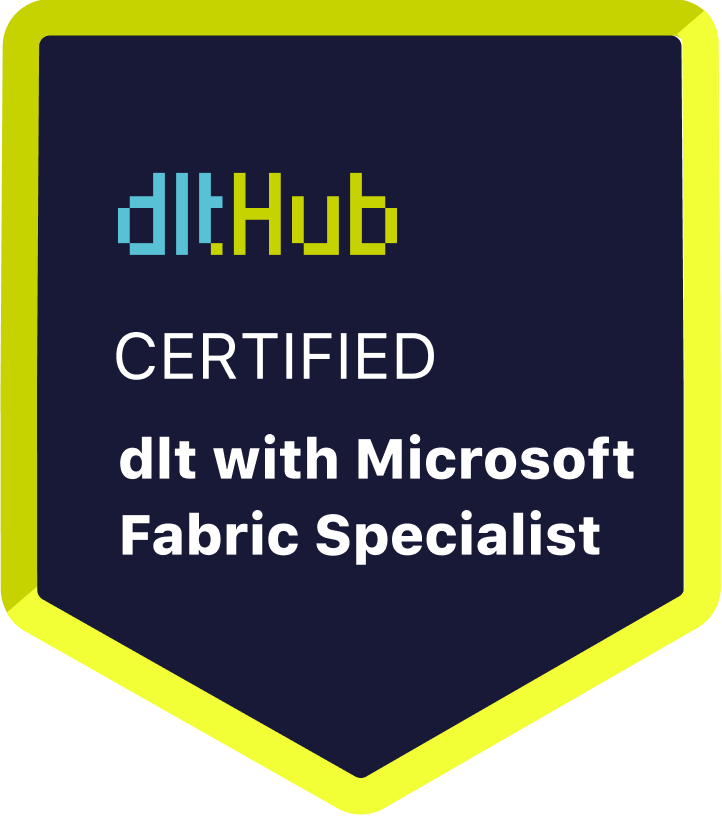

# Certificate of Achievement: dlt Microsoft Fabric Specialist

## Awarded to **Jón Kaldal**

### Certificate Details
- **Certificate ID**: `bd18bf89a1f1f28888c798fd89e614246239b0cbec4658483f190d05079c66fd`
- **Certificate Holder ID**: `2a60037aa4b6b2286f9e83a80c9e8c0572914d9c0b34ac3e57012ba6680b5397`

### Course Information
- **Course**: [Build secure code-first data pipelines in Microsoft Fabric](https://www.youtube.com/live/wca8DnKucBM)

### Issued by
[**dltHub**](https://dlthub.com/) 

### Certification Period
- **Issued**: May 2025
- **Valid Until**: No expiration

---

## Contact Information
- **GitHub**: 
- **Contact**: 

## Comments
Jón Kaldal has successfully completed the Build secure code-first data pipelines in Microsoft Fabric. We commend their dedication and expertise in the field.

---

For more information, please visit [dltHub](https://dlthub.com/).
    