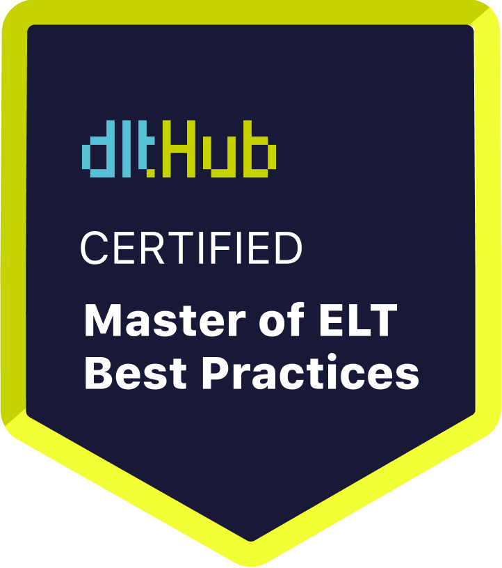

# Certificate of Achievement: Master of ELT Best Practices

## Awarded to **Jayanth Kumar G**

### Certificate Details
- **Certificate ID**: `ec68207458200eaf93a7f64e8f3688e88b25b3b47ac5677babc935cbbfd53dda`
- **Certificate Holder ID**: `41658c1e12a32a3c96f58d61b676162e276906812f969cc92041208545c600da`

### Course Information
- **Course**: [Data Engineering with Python and AI/LLMs](https://www.youtube.com/watch?v=T23Bs75F7ZQ)

### Issued by
[**dltHub**](https://dlthub.com/) 

### Certification Period
- **Issued**: July 2025
- **Valid Until**: No expiration

---

## Contact Information
- **GitHub**: https://github.com/Jayanth0721
- **Contact**: https://www.linkedin.com/in/jayanthkumarg/

## Comments
Jayanth Kumar G has successfully completed the Data Engineering with Python and AI/LLMs. We commend their dedication and expertise in the field.

---

For more information, please visit [dltHub](https://dlthub.com/).
    