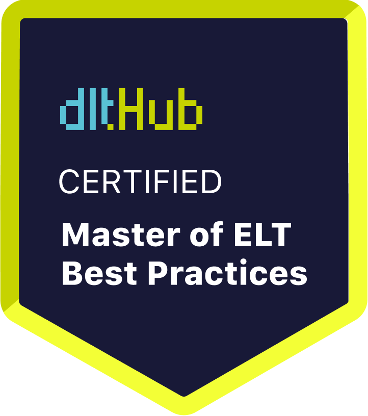

# Certificate of Achievement: Master of ELT Best Practices

## Awarded to **Carlos Saritama**

### Certificate Details
- **Certificate ID**: `fc40fe215b171fdd98b3d12bdc44168a7fed0bd4c8882d3cfedd5ec7278610b3`
- **Certificate Holder ID**: `e6cab61e94e90dc8e3c035d08c2691df5a1780eb6b84053d32872cc5f6237585`

### Course Information
- **Course**: [Data Engineering with Python and AI/LLMs](https://www.youtube.com/watch?v=T23Bs75F7ZQ)

### Issued by
[**dltHub**](https://dlthub.com/) 

### Certification Period
- **Issued**: June 2025
- **Valid Until**: No expiration

---

## Contact Information
- **GitHub**: nan
- **Contact**: nan

## Comments
Carlos Saritama has successfully completed the Data Engineering with Python and AI/LLMs. We commend their dedication and expertise in the field.

---

For more information, please visit [dltHub](https://dlthub.com/).
    