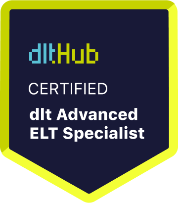

# Certificate of Achievement: dlt Advanced ELT Specialist

## Awarded to **Igor Dal Bo**

### Certificate Details
- **Certificate ID**: `fc6c4f0ef945d0ed2699411b12a4588434b1fff86ca3e476d42cba0c10e8799d`
- **Certificate Holder ID**: `50fa836c5499c1f40a35446227d005f3a9e1e0ea9dccc54fb24798202b7e9f2b`

### Course Information
- **Course**: [Workshop: ELT with DLT](https://github.com/dlt-hub/dlthub-education/tree/main/workshops/workshop_august_2024)

### Issued by
[**dltHub**](https://dlthub.com/) 

### Certification Period
- **Issued**: September 2024
- **Valid Until**: No expiration

---

## Contact Information
- **GitHub**: TBA
- **Contact**: TBA

## Comments
Igor Dal Bo has successfully completed the Workshop: ELT with DLT. We commend their dedication and expertise in the field.

---

For more information, please visit [dltHub](https://dlthub.com/).
    